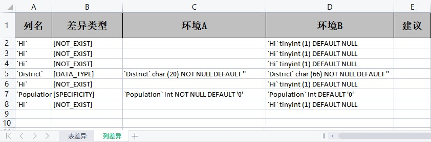

:author: AllinProgram.com
:toc: macro
:toc-title: 目录
= compare-database-differences

本项目可以帮助快速比较两个不同数据库的表字段差异，尤其适合同一项目不同环境之间的对比，帮助快速发现差异，避免不同环境部署代码时数据库结构的不兼容。

toc::[]

== 特性
- [x] 支持MySQL（MySQL8需要更新驱动依赖，后续会动态处理）
- [x] 支持OceanBase以及分库分表场景
- [x] 发现环境特有的表
- [x] 发现表特有的字段
- [x] 发现字段数据类型不一致的情况
- [x] 发现字段数据限制不一致的情况
- [x] 支持将差异数据生成文件方便查看
- [ ] 发现表索引差异
- [ ] 发现表规格差异
- [ ] 支持给出修复差异的策略
- [ ] 支持GUI客户端使用
- [ ] 支持IDEA插件使用

== 怎么使用
=== 场景1：本地能够连接数据库
[source, java]
....
public class Main {
    public static void main(String[] args) {
        new DBCompareStart(
                new DBCompareStart.DBConfig(
                        "A环境",
                        "jdbc:mysql://hostA:portA/databaseA",
                        "username",
                        "password"),
                new DBCompareStart.DBConfig(
                        "B环境",
                        "jdbc:mysql://hostB:portB/databaseB",
                        "username",
                        "password")
        );
    }
}
....

=== 场景2：本地无法直连数据库，或者仅有一个库可以直连
[source, java]
....
public class Main {
    public static void main(String[] args) {
        new DBCompareStart(
                new DBCompareStart.DBConfig(
                        "A环境",
                        "src/main/resources/a-create-table.sql"),
                new DBCompareStart.DBConfig(
                        "B环境",
                        "jdbc:mysql://hostB:portB/databaseB",
                        "username",
                        "password")
        );
    }
}
....

== 执行示例
